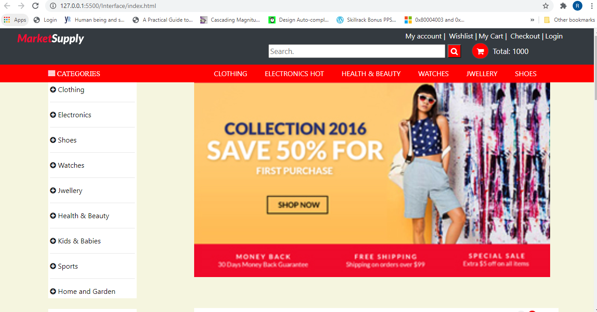
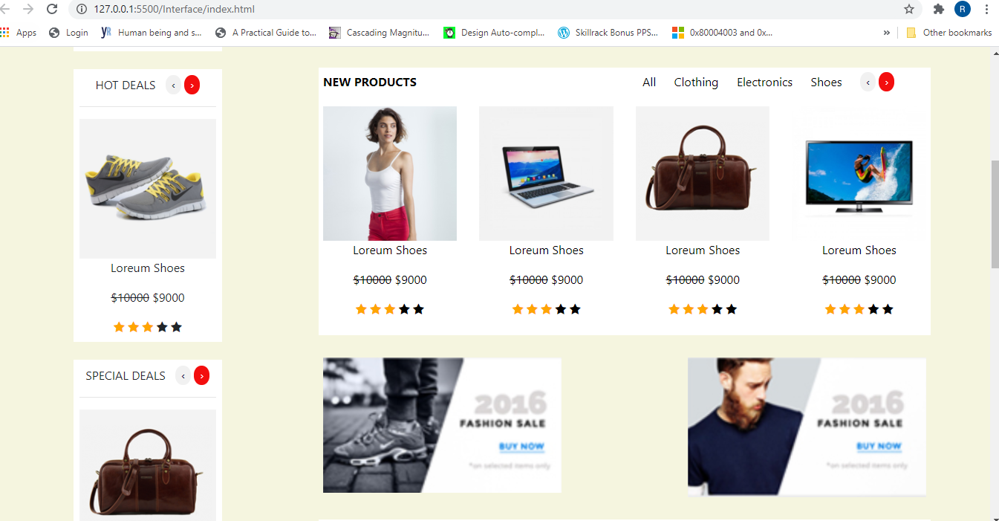
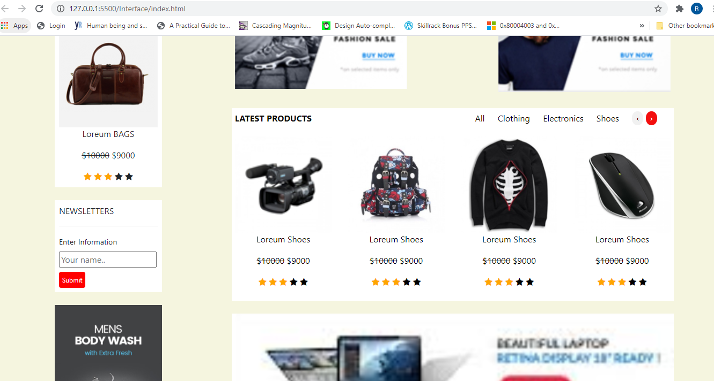
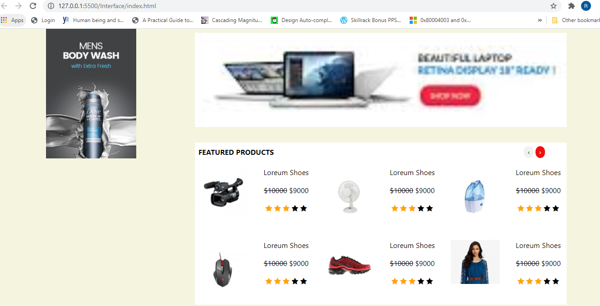
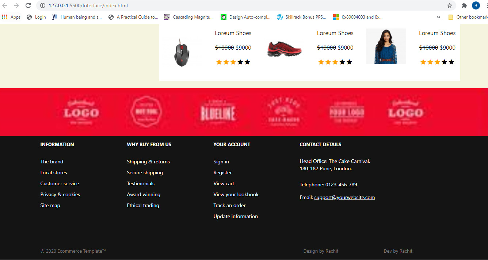

# Ecommerce-Template
Steps to run the project:- 
1. Clone the project to the respective Xamp or Wamp folder 
2. Run the index.html file 

Description:- 
It is a simple Ecommerce website Template.  
<h2>OUTPUT Screenshots</h2>  
  
  
  
  
  
